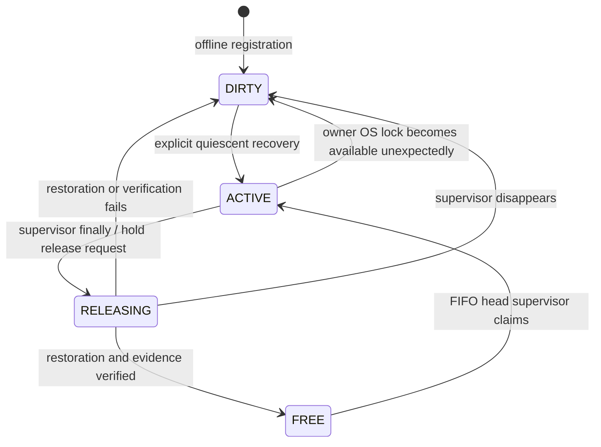

# Clocky Device Broker v2

Implementation scope: developer tooling on one Windows PC, under one Windows account.
No Android app changes, moto operations, or Phase 5+ device verification were performed
while implementing this broker. Issue [#51](https://github.com/stupidsavacan/Clocky/issues/51)
is historical audit evidence, not the arbitration database after migration.

## Authority and storage

All participating worktrees must contain the merged broker implementation and use the
same registry. Default: `%LOCALAPPDATA%\Clocky\device-broker\`. `CLOCKY_BROKER_ROOT`
(or a lease command's `--root`) supports isolated host tests/custom **local** paths;
it must never be changed to evade a live lease. Network/cloud-synced filesystems are
not supported. Separate Windows accounts need a deliberately shared local directory
and appropriate ACLs; the per-user default alone does not coordinate them.

`registry.json` version 2 contains a record per physical `ro.serialno`:

| Field | Meaning |
|---|---|
| identity / serials | Physical identity and explicitly registered USB/Wi-Fi aliases |
| owner | Agent, unique session, credential hashes, supervisor PID for diagnostics, worktree, acquisition time, shared evidence directory |
| queue | Persistent ordered requests, agent/session/hash/worktree/time |
| state | FREE, ACTIVE, RELEASING or DIRTY |
| installed | SHA-256 of observed installed base.apk bytes; last known source commit or explicit UNKNOWN |
| baseline | Original widget IDs, settings hash, geometry/display metadata, screenshot/evidence path and installed APK record |
| last_clean_handoff / last_result | Verified handoff result, test exit code, installed APK, local evidence paths and errors |
| recovery_required / reason | Fail-closed recovery gate and explanation |
| retired_sessions | Used/cancelled session IDs; stale credentials cannot become valid again |

`registry.lock` uses `msvcrt.locking(..., LK_NBLCK, 1)` on Windows, with retry for
contention. Registry read/modify/write happens inside this OS lock. Updates use a
unique temporary file, flush/fsync, then `os.replace`. Existing lock files do not
grant access. A persistent `enabled` marker makes registry deletion fail closed.
Malformed/missing enabled registries are refused, not reconstructed as FREE.
The POSIX flock implementation supports offline host tests; Windows is the deployment target.

Each identity also has two OS locks:

- `owner.lock`: held open by the `run`/`hold`/`recover` supervisor for the entire lease.
  A nonblocking probe detects a vanished supervisor, avoiding PID-reuse/timeout heuristics.
- `operation.lock`: held across each cdev command, including all ADB subprocesses or
  GUI lifetime. Release waits for the operation to finish before entering RELEASING.

Lock order: operation then registry for device operations/release; owner then registry
for claim. Registry critical sections never wait for owner or operation locks.
Status and queue operations require no ADB or connected phone.

## FIFO and lifecycle



Requests are ordered by serialized append order, not an unsynchronized wall clock.
An identical agent/session/token request is idempotent; conflicting duplicates fail.
Only the head can claim FREE. Normal release allows the waiting head's next local
poll to claim; there is no grant acknowledgement, GitHub polling, or Owner approval.
The short interval between release and the head's poll can remain FREE, but later
requests cannot overtake it. Durable detached requests whose supervisors never start
stay in the queue until authenticated cancellation; they are not silently expired.

A killed supervisor leaves ACTIVE/RELEASING on disk. The next status/request/access
observes the free lifetime lock and persists DIRTY + RECOVERY_REQUIRED. No lease
timeout, elapsed time, or missing PID can grant a new ordinary owner. A wait timeout
cancels that request; a hold's own duration expiry attempts its own clean return.
Each additional verification unit requires a fresh session and another FIFO request.

## cdev gate and process lifetime

Before device commands (including devices, status, screen/log reads, install and raw
ADB), cdev resolves the explicitly registered serial from local state and verifies
`CLOCKY_DEVICE_IDENTITY`, `CLOCKY_LEASE_SESSION`, and the lease token hash. It then
holds the operation lock. Only the selected serial is probed with `getprop ro.serialno`;
physical identity must match before further access. Other phones are not discovered.
Unregistered aliases and ambiguous/unscoped access are refused after broker enablement.
This conservative policy also blocks unregistered devices on the same account; any
new device requires separate explicit registration/recovery (outside current moto scope).
Local `compare` and `lease status` do not need a lease or ADB.

Shared cdev session state/evidence lives under
`devices/<identity-sha256>/leases/<lease-session>/`, independent of checkout. A command
from another worktree with the same credentials sees the same pending restore/session.
Existing v1 handlers and local `build/device` behavior remain when no registry is enabled.
No production dependency was added. Installed provenance is separate from the checkout
used to run cdev: a checkout's HEAD is never assumed to be the installed APK's source.

RELEASING rejects the test token. A separate private cleanup token is held by the
supervisor and passed only to restoration commands/hooks. `lease release` just requests
the hold supervisor to return; it cannot label a device clean. `cdev finish` alone
also cannot release a broker lease. The trusted Python library's `Lease.complete`
consumes the supervisor's verification result; it is not an API for untrusted clients.
During initial baseline capture the ACTIVE owner phase is PREPARING and only the
supervisor's private setup token works. The interactive credential file's test token
becomes valid only after baseline capture reaches READY, preventing early test operations.

Managed Windows subprocesses are created suspended, assigned to a Job Object with
KILL_ON_JOB_CLOSE, then resumed. Descendants are terminated and Job accounting is
checked for zero active processes before returning. Job assignment failure refuses
execution. Host test/restoration processes and `cdev project` must be finite; do not
launch detached device clients. Interactive cdev operations also wrap their ADB
subprocesses in jobs. Normal projection holds the operation lock, so simultaneous
cdev commands wait until the GUI closes; use a short projection unit and release it.

Managed ADB requires an already running local server on port 5037. It queries the
host-only `host:version` protocol and compares it to offline `adb version` before
device commands, refusing mismatches that would trigger implicit server restart.
Server endpoint environment overrides are refused. scrcpy receives the same ADB
executable via `ADB`, as documented in the [upstream FAQ](https://github.com/Genymobile/scrcpy/blob/master/FAQ.md).
The server protocol is documented by [AOSP SERVICES.TXT](https://android.googlesource.com/platform/packages/modules/adb/+/refs/heads/main/SERVICES.TXT).
There is still a race with external programs changing the server after the check;
such programs must be quiescent under the cooperative workflow.

## Verification transaction

`lease run` and `lease hold` automatically:

1. Acquire the FIFO lease. Read actual installed APK bytes/SHA and known source commit.
2. Run cdev prepare. Collect the original widget/settings/display/UI/screenshot baseline.
   Require complete evidence, readable settings, a visible launcher page, and all existing
   Clocky widgets visible. Partial evidence is refused (only optional Pillow thumbnail failure is allowed).
3. Execute the finite test command, or allow interactive cdev commands under hold.
   Optional install uses `cdev install APK --source-commit <full 40-character commit>`;
   it uses install -r and checks the installed APK hash. Raw broker install is refused.
4. In finally, enter RELEASING, stop the test process tree, run the optional restoration
   script, cdev restore, collect/compare against the original baseline, and cdev finish.
5. Verify settings/widgets, host/view geometry, display settings and rotation. Require
   no PENDING RESTORE; record the actual remaining APK/commit and result locally.
   Clean returns FREE; any incomplete restoration/evidence/finish returns DIRTY.

A nonzero completed test can return clean if restoration passes; its test failure is
recorded independently. A supervisor execution exception conservatively marks DIRTY
after attempting restoration. The normal child token cannot operate during cleanup.

cdev restore restores the allowlisted device rotation/stay-awake values, **not app
widget preferences or launcher placement**. Tests that alter widget configuration
or placement must supply a finite `--restore-script` that uses cdev UI operations to
restore the existing widgets/settings. It receives `CLOCKY_BASELINE_DIR` and fresh
cleanup credentials. There is no blind SharedPreferences-file replacement while the
app is running, no launcher database rewrite, no widget recreation and no downgrade.
If no restoration script is provided, only tests that preserve the widget baseline
are appropriate; drift blocks the next agent. A restoration script's exit 0 alone
cannot certify clean: the following independent collection and comparison must pass.

The current APK is retained on return. Data preservation is checked through existing
widget IDs/settings and geometry, and SHA/source commit are reported. Unknown source
stays UNKNOWN. This does not verify every app database/preferences file. No automatic
baseline APK restore is attempted; an older APK may be unsafe with newer data/schema.
All installs require -r; no uninstall, pm clear, force-stop, server restart, existing
widget deletion or install -d is permitted by the workflow.

Saved screenshots support review of appearance. Automated clean verifies settings
and view/host geometry, **not pixel equivalence or all rendering colors/fonts** (clocks
and notifications change). It does not certify an Android feature or Phase 5+ compatibility.
If an observation needs stronger visual proof, the scoped test/restoration script
must perform that check; do not report unperformed checks as successful.

## Recovery

`lease recover --acknowledge-quiescent --reason ... -- <finite command>` requires
DIRTY and a free owner lock. The acknowledgement means the operator has stopped old
unmanaged ADB/scrcpy and reviewed preserved evidence; it is never live-lease revocation.
Recovery uses the saved **original** baseline and cdev state directory so pending
settings survive worktree/process loss. Failed recovery remains DIRTY and preserves
the queue. Successful verification returns FREE for the existing FIFO head.

If the previous supervisor failed before recording a complete original baseline,
recovery refuses to bless the current state. Investigate partial evidence, then supply
an explicit operator-reviewed original `--baseline <bundle>` when available. This
option cannot replace an already saved baseline. For missing/corrupt registry files,
preserve backups and reconcile the record while all clients are quiescent; deleting
the enabled marker/locks is not a recovery procedure. An offline initial registration
has no previous session and uses an explicit bootstrap recovery to establish its baseline.

## Migration of Issue #51 (not performed during this implementation)

1. Merge/review this tooling PR first. Update every independent agent checkout to
   that merged implementation. Until then, no agent may assume Broker v2 is available.
2. Stop legacy device activity and all unmanaged projection/recording. Reconcile the
   current Owner and any unfinished cdev sessions. Do not infer FREE from comment silence.
3. Review #51's final historical record: Issue54 returned to Owner, widget 23,
   source `7c2eae7`, reported SHA
   `0f3e3bdb7353b02d6aed3164ad2d38c12253d5a180e687e704b5354c87658d27`.
   These are historical reports, **not current device observations**. Preserve prior
   `build/device/state.json` and session evidence; resolve any legacy pending restore
   before registration while the existing Owner still controls the device.
4. Register the known identity/USB alias offline (README example). Registration creates
   DIRTY, never FREE. Do not register alternate aliases by guessing identity.
5. Under an explicitly quiescent migration window, place the existing widgets on the
   visible launcher page and bootstrap recover using the preservation-only smoke script.
   This step actually uses the device and must be scheduled after this implementation task.
   Record newly observed SHA; the source commit is UNKNOWN unless previously verified
   provenance matches that SHA or a broker-managed install establishes it.
6. Add an Issue #51 comment linking the merged PR, registry path, migration verification
   summary, and remaining APK/commit. State that #51 is audit history and local Broker
   FIFO is the authority. Do not paste credential files, registry contents, raw evidence,
   serials or screenshots. Update the issue body protocol only after bootstrap succeeds;
   retain/link its historical protocol rather than erasing audit history.
7. Agent A/B edit/build/unit-test concurrently. Each requests immediately before one
   finite device unit, waits locally, and returns promptly. Additional units requeue.

Suggested #51 migration comment (fill with actual evidence, never predeclare success):

> Device Broker v2 migration | merged PR=<URL> | bootstrap=<verified/pending>
> | handoff summary=<PR-safe summary> | remaining APK SHA=<observed> |
> source commit=<verified or UNKNOWN>. All participating agents use the merged cdev
> broker and shared local registry. This issue retains audit history; it no longer
> grants leases after verified bootstrap. Before bootstrap, the existing Owner protocol applies.

## Limits and verification

This is a cooperative developer boundary, not an OS security sandbox. A same-user
process can edit registry files, select another root, import the low-level API, or run
old cdev/direct ADB/scrcpy. OS permissions cannot prohibit those external programs
without an additional account/service/driver policy. Tokens protect accidental
cross-session use, not hostile same-account code. Credentials/evidence inherit the
directory's ACLs; keep them private and off Git/cloud sync. Job containment covers the
managed host descendants, not Android processes or programs launched outside the job.
Reboot, phone disconnect, server disappearance and unknown identity do not cause stealing.

Host tests use independent Python processes and temporary registries/worktree directories.
They cover simultaneous A/B requests, three FIFO waiters, release races, duplicate
request/release, invalid tokens/sessions/identity, cancellation/wait timeout, stale
credentials, owner death, failed restoration, clean recovery, evidence failure/drift,
pre-ADB cdev refusal, unconfigured v1 behavior, server protocol refusal and Windows
Job lifetime/timeout/descendant termination. Run the existing complete suite:

```powershell
python -m unittest discover -s tools/device/tests -t tools/device
```

Hardware prepare/restore/install, scrcpy recording and screenshot appearance were
not exercised in this PR. Host tests are not substitute moto verification.

The dedicated `device-tooling.yml` workflow runs the same offline suite on Windows
and Ubuntu for tooling PRs. Neither runner connects to Android hardware/emulators;
this is host tooling validation, not Phase 5+ device-matrix work.
